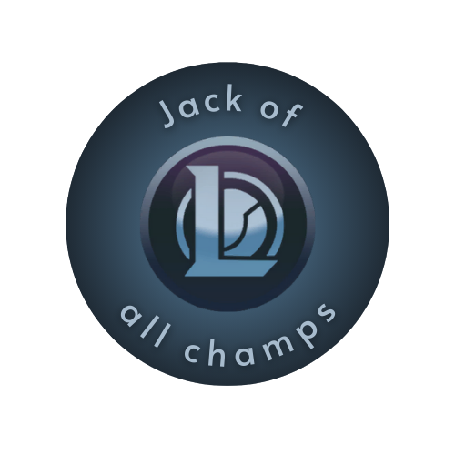

<div id="top"></div>

[![Contributors][contributors-shield]][contributors-url]
[![Forks][forks-shield]][forks-url]
[![Stargazers][stars-shield]][stars-url]
[![Issues][issues-shield]][issues-url]
[![MIT License][license-shield]][license-url]
[![LinkedIn][linkedin-shield]][linkedin-url]


<!-- PROJECT LOGO -->
<br />
<div align="center">
  </img>
  <h3 align="center">A discord bot for tracking your wins with all Champs</h3>
</div>


<!-- TABLE OF CONTENTS -->
<details>
  <summary>Usage</summary>
  <ol>
    <li>
      <a href="#about-the-project">About The Project</a>
    </li>
    <li>
      <a href="#getting-started">Getting Started</a>
      <ul>
        <li><a href="#prerequisites">Prerequisites</a></li>
        <li><a href="#installation">Installation</a></li>
      </ul>
    </li>
    <li><a href="#usage">Usage</a></li>
    <li><a href="#roadmap">Roadmap</a></li>
    <li><a href="#contributing">Contributing</a></li>
    <li><a href="#license">License</a></li>
    <li><a href="#contact">Contact</a></li>
    <li><a href="#acknowledgments">Acknowledgments</a></li>
  </ol>
</details>


<!-- ABOUT THE PROJECT -->
## About The Project

Recently Riot Games added challenges to League of Legends, in particular one called "Jack of All Champs" that requires you to win at least once with every champion on the game.

The game itself lets you see the wins you have on each champions but only if you are not in champion select and sometimes you forget to check it before queueing or you just play fill and dont bother to check every lane for a champ. Since I had this problem I needed a way to track which champion have ready won a game, so instead of just writting them down on a notepad I compiled a spreadsheet with every champion on the lane which are played as League Patch 12.11 and made a discord bot that gives me a champion without a win on the lane I desire.


<p align="right">(<a href="#top">back to top</a>)</p>


<!-- GETTING STARTED -->
## Getting Started

To develop the bot, we will be using Python as our programming language. For data, we will create a data base using PostgreSQL, and discord.

### Prerequisites

The developing tools we used are the following:

* Python3
* Discord.py
  ```sh
  pip install -U discord.py      
  ```
* gspread
  ```sh
  pip install -U gspread      
  ```
* A google account
* A discord account
  

### Installation

1.  Clone the repo
   ```sh
   git clone https://github.com/JorNiebla/lolchamps.git
   ```

<p align="right">(<a href="#top">back to top</a>)</p>

<!-- USAGE EXAMPLES -->
## Usage

Use this space to show useful examples of how a project can be used. Additional screenshots, code examples and demos work well in this space. You may also link to more resources.

_For more examples, please refer to the [Documentation](https://example.com)_

<p align="right">(<a href="#top">back to top</a>)</p>


<!-- LICENSE -->
## License

Distributed under the Apache License. See `LICENSE.txt` for more information.

<p align="right">(<a href="#top">back to top</a>)</p>


<!-- CONTACT -->
## Contact

* Jorge Niebla - https://github.com/JorNiebla
* Daniel del Castillo de la Rosa - https://github.com/Daniel-del-Castillo
* Antonella García - https://github.com/confliicted

Project Link: [LolChamps](https://github.com/JorNiebla/lolchamps)

<p align="right">(<a href="#top">back to top</a>)</p>


<!-- ACKNOWLEDGMENTS -->
## Acknowledgments

Use this space to list resources you find helpful and would like to give credit to. I've included a few of my favorites to kick things off!

* [Choose an Open Source License](https://choosealicense.com)
* [GitHub Emoji Cheat Sheet](https://www.webpagefx.com/tools/emoji-cheat-sheet)
* [Malven's Flexbox Cheatsheet](https://flexbox.malven.co/)
* [Malven's Grid Cheatsheet](https://grid.malven.co/)
* [Img Shields](https://shields.io)
* [GitHub Pages](https://pages.github.com)
* [Font Awesome](https://fontawesome.com)
* [React Icons](https://react-icons.github.io/react-icons/search)

<p align="right">(<a href="#top">back to top</a>)</p>


<!-- MARKDOWN LINKS & IMAGES -->
<!-- https://www.markdownguide.org/basic-syntax/#reference-style-links -->
[contributors-shield]: https://img.shields.io/github/contributors/JorNiebla/lolchamps.svg?style=for-the-badge
[contributors-url]: https://github.com/JorNiebla/lolchamps/graphs/contributors
[forks-shield]: https://img.shields.io/github/forks/JorNiebla/lolchamps.svg?style=for-the-badge
[forks-url]: https://github.com/JorNiebla/lolchamps/network/members
[stars-shield]: https://img.shields.io/github/stars/JorNiebla/lolchamps.svg?style=for-the-badge
[stars-url]: https://github.com/JorNiebla/lolchamps/stargazers
[issues-shield]: https://img.shields.io/github/issues/JorNiebla/lolchamps.svg?style=for-the-badge
[issues-url]: https://github.com/JorNiebla/lolchamps/issues
[license-shield]: https://img.shields.io/github/license/JorNiebla/lolchamps.svg?style=for-the-badge
[license-url]: https://github.com/JorNiebla/lolchamps/blob/master/LICENSE
[linkedin-shield]: https://img.shields.io/badge/-LinkedIn-black.svg?style=for-the-badge&logo=linkedin&colorB=555
[linkedin-url]: https://www.linkedin.com/in/jorge-niebla-n%C3%BA%C3%B1ez/
[product-screenshot]: images/Blitzcrank.png
